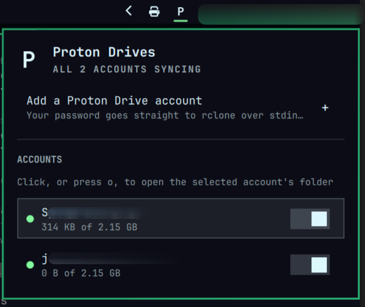

<h1>Proton Drives</h1>



Proton Drive, mounted like a real folder, for as many accounts as you have.
A bar widget for [Omarchy](https://omarchy.org/) that turns Proton Drive
into `~/ProtonDrive/<account>`, right there in your file manager, no browser
tab required.

## Why this one

- **Feels like a real drive, because it is one.** A genuine FUSE mount
  (`rclone mount --vfs-cache-mode=full`), not a browser tab or a
  list-and-download panel. Open, save, and drag files in any app exactly
  like a local folder: content fetches on demand, and recently-used files
  stay cached for offline access.
- **rclone under the hood, so it's fast.** Proven, widely-used sync
  engine doing the heavy lifting. No custom, reinvented transfer logic
  slowing things down.
- **Multiple accounts, at once.** Personal, work, whatever else: each
  gets its own row in the panel, its own folder, its own pause/resume
  toggle, all signed in and syncing simultaneously.

## Install

```bash
git clone <this-repo> && cd omarchy-protondrive
omarchy plugin add "$(pwd)" --enable   # or: omarchy plugin add <git-url> --enable
./install.sh                            # installs rclone + helper scripts, enables the widget
```

Click "Add a Proton Drive account" in the panel, a real in-app form, email
and password straight to rclone over the process's own stdin, never a
command-line argument, never written to disk, never logged. Add as many
accounts as you like; each shows up as its own row.

Remove with `./uninstall.sh` (your signed-in accounts and synced files are
left alone; see the script for exactly what it does and doesn't touch).

## Developing

Pulled a code change into an already-installed copy with `omarchy plugin
update`? Also run `omarchy restart shell`, an active bar widget doesn't
reload its QML from a plugin rescan alone.

The fuller design writeup (why rclone, the multi-account approach, and
what's still on the roadmap) lives in [PLAN.md](PLAN.md).

## License

MIT, see [LICENSE](LICENSE).
